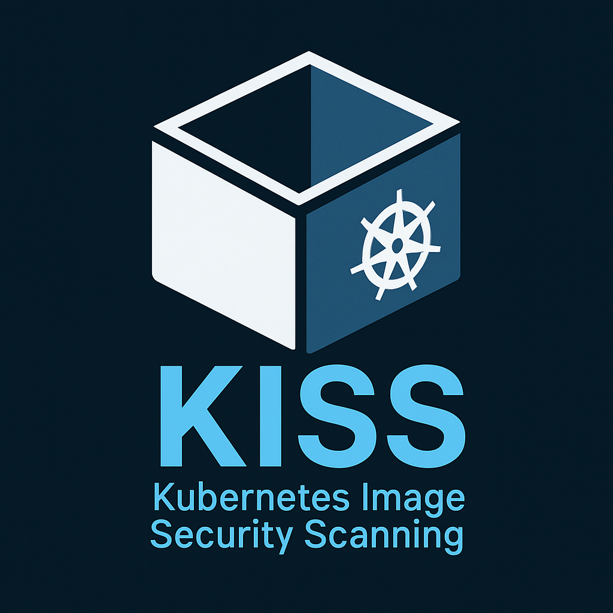

# KISS

KISS is a command line tool for showing and scanning container images for vulnerabilities running in Kubernetes clusters.

<p align="center"></p>

## Table of Contents

- [KISS](#kiss)
  - [Table of Contents](#table-of-contents)
  - [Description](#description)
  - [What KISS does](#what-kiss-does)
  - [Prerequisites](#prerequisites)
  - [Installation](#installation)
  - [Usage](#usage)
  - [Current and Planned Features](#current-and-planned-features)
  - [License](#license)

## Description

This repository contains a source code of KISS application.
KISS is a command line tool for showing and scanning container images for vulnerabilities running in Kubernetes clusters.

If images you are planning to scan are stored in private container registry, you need to make sure that trivy can access them.
Please refer to the following trivy documentation for more information on how to configure trivy to access private container registries: [https://trivy.dev/v0.62/docs/advanced/private-registries/](https://trivy.dev/v0.62/docs/advanced/private-registries/)

## What KISS does

- uses Trivy as a vulnerability scanner and extends a bit its functionality to provide ability to scan whole namespace(-s) at once.
- automatically detecting all container images (including init or ephemeral containers) running in specified namespace(-s).
- uses caching to avoid scanning same image multiple times.
- uses configurable parallel processing of images and namespaces to speed up the process of scanning images.
- you can filter images by severity and omit images with no vulnerabilities.
- you can sort images by severity
- you can select multiple namespaces by name or by label just like in `kubectl` command.
- different scan levels are supported: basic and full. Basic scan level shows only summary of vulnerabilities by severity. Full scan level shows detailed report of vulnerabilities for each image.

## Prerequisites

As kiss uses Trivy vulnerability scanner under the hood, you need to have it installed on your system
To install follow the instructions from [Trivy installation guide](https://trivy.dev/latest/getting-started/installation/)

NB! If you plan to use KISS to quick image list and not to scan them, then you don't need to install Trivy as it is not used in this case.

## Installation

To install KISS on debian/ubuntu use the following commands:

```bash
## Define the version of KISS you want to install
export KISS_VERSION=0.1.0
wget https://github.com/andriktr/kiss/releases/download/v$KISS_VERSION/kiss_Linux.tar.gz
tar -xzf kiss_Linux.tar.gz
sudo mv kiss /usr/local/bin/kiss
sudo chmod +x /usr/local/bin/kiss
```

To install on  MACOS use the following commands:

```bash
## Define the version of KISS you want to install
export KISS_VERSION=0.1.0
wget https://github.com/andriktr/kiss/releases/download/v$KISS_VERSION/kiss_macOS.tar.gz
tar -xzf kiss_macOS.tar.gz
sudo mv kiss /usr/local/bin/kiss
sudo chmod +x /usr/local/bin/kiss
```

To install on WINDOWS:

1. Download desired version https://github.com/andriktr/kiss/releases/download/vX.X.X/kiss_windows.zip
2. Unzip the file
3. Move the kiss.exe file to your any folder you want
4. Optionally add the folder to your PATH environment variable

## Usage

Use `kiss --help` to see the list of available commands, options and descriptions.

Current version of KISS supports the following commands:

- `kiss show-images` - show all images running in specified namespace(-s).
- `kiss scan-images` - scan all images running in specified namespace(-s).

Here is a short video tutorial showing how to KISS:

https://github.com/user-attachments/assets/00603aeb-37da-4763-889c-0c94ae26d529

## Planned Features

Feature | Status
--- | ---
Add new `kiss report` command which will allow to output whole cluster images as one report | :x:

## License

This project is licensed under the MIT License - see the [LICENSE](LICENSE) file for details.
This project is not affiliated with or endorsed by the Kubernetes project or the Cloud Native Computing Foundation (CNCF).
The KISS application is an independent tool developed for educational and research purposes. Use it at your own risk.
